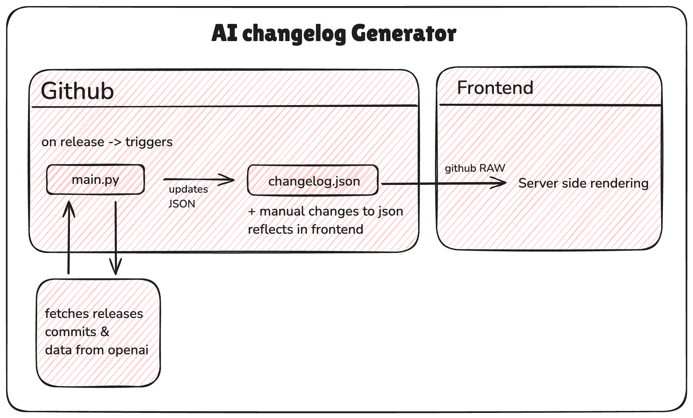
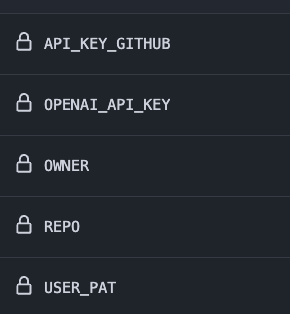

# AI Powered Changelog Generator

[](https://github.com/JaynouOliver/changelog/releases)
[](LICENSE)
[](CONTRIBUTING.md)

> Automatically generate beautiful changelogs from your GitHub releases using AI 

##  Overview

Consists of two main parts:
- `backend_api`: Core logic for AI-powered changelog generation
- `canvas`:  Next.js frontend for displaying changelogs

##  Key Features

- 🤖 AI-powered commit analysis and summarization
- 🔄 Automatic updates triggered by GitHub releases
- 📱 UI inspired by Cursor's changelog page˘
- 🎨 Manual override capability for custom edits
- 🚀 Server-side rendering for optimal performance


## Architecture Considerations

1. We had to make a project where the AI changelog result was generated by AI but you need to have a manual intervention in case you want to change anything. (eg. a static image)

2. The worflow must be simple, for developers, both for generating the changelog and editing the frontend.

3. UI had to simple and easily changeable from source code. Nothing complex, should be as simple as editing a Readme like we edit docs page.

## Possible System Designs that I considered and what led me to the final architecture

We have a python function that returns a changelog reponse (eg. through JSON) or an API.

1. We can pass data through DB, and fetch it on website - Reduces scope of changing data manually
2. Using github actions to fetch data from API and update frontend with ...maybe vercel weebhook - this is a complex flow, reduces scope of manual editing
3. Use a readme to JSON converter or using MDX format, which is good for manual editing, but again poses problem for inconsistent structred responses from OpenAI API. 
4. All in all we needed is a solution that can generate changelog from LLMs + structured response + manual editing + frontend easy deployment + scope for adding more content in frontend.

## 🏗️ Architecture

The challenge with writing changelogs is twofold:
1. Analyzing numerous commits between releases
2. Summarizing changes in a user-friendly format

### How it Works

1. **Release Detection**: Triggered automatically on new GitHub releases
2. **Commit Analysis**: Fetches and analyzes commits between releases
3. **AI Processing**: Generates structured changelog using OpenAI API
4. **Manual Override**: Allows custom edits to the generated JSON
5. **Frontend Display**: Renders beautiful, responsive changelog pages




### Setup Instructions


1. Add the ```backends_api``` folder and ```chanelog.yml``` in your repo. Make sure you write the proper path to ```main.py``` in ```chanelog.yml```

2. Add ENVs in github, please refer to ```.env.example```



Repository Variables:
- `owner`: Repository owner name
- `repo`: Repository name

Environment Secrets:
- `OPENAI_API_KEY`: Your OpenAI API key
- Additional configuration secrets as needed

Currently, all configurations are set as environment variables instead of repository variables for simplicity. This will be improved in future updates.


## 🚧 Known Limitations

1. **Multiple Release Requirement**: Currently requires at least 2 releases
2. **Duplicate Prevention**: Manual triggering may create duplicate entries
3. **Rate Limiting**: Subject to GitHub API and OpenAI API limits
4. **Delay**: Expect little delay in frontend updates due to caching in Github CDNs, and frontend. (upto 5 mins)

## 🛣️ Roadmap

- [ ] Single-release repository support
- [ ] Custom changelog templates
- [ ] Duplicate detection

## 🤝 Contributing

Contributions are welcome! Please feel free to submit a Pull Request.

## 📄 License

This project is licensed under the MIT License - see the [LICENSE](LICENSE) file for details.

## 🙏 Use of AI

- AI used is minimal, used tools -- perplexity for frontend research , design. Cursor for readme. I don't trust LLMs that much with code generation. 😂


